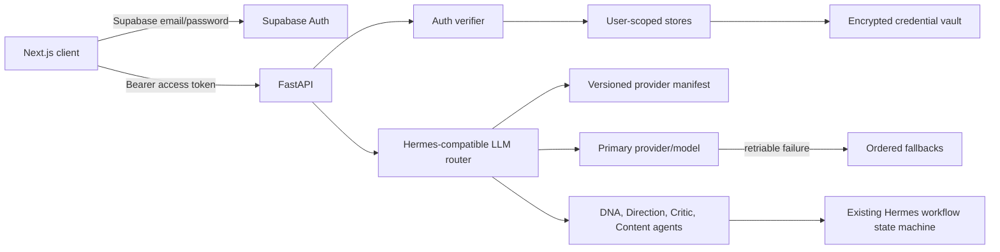

# Authenticated Hermes-Compatible BYOK Design

Date: 2026-07-22
Status: Approved design, pending written-spec review

## Objective

Replace deterministic creative-agent output with real LLM execution selected by each authenticated user. Add basic Supabase email/password authentication, persistent encrypted BYOK settings, one primary provider/model with ordered fallbacks, and a precise product UI governed by `PRODUCT.md` and `DESIGN.md`.

This milestone keeps the existing Brief, DNA, Outputs, reject-two, refine, approve, and execute workflow. It changes who owns data, how AI output is produced, and how users configure that production path.

## Approved Decisions

- Supabase email/password authentication only.
- Provider settings persist per authenticated user across logout and later login.
- API keys are encrypted by the backend. Supabase stores ciphertext only.
- Provider catalog covers Hermes API-key providers only.
- Provider slugs, credential aliases, base URLs, API modes, and model identifiers follow Hermes conventions.
- One global primary provider/model and an ordered fallback chain.
- Existing workflow state machine remains authoritative.
- Deterministic creative content is removed. Tests may use fake transports, but production never substitutes canned output.
- Development and migrations use local Supabase only. Remote Supabase operations remain prohibited without explicit approval.
- Full Supabase hardening and production deployment controls remain deferred.
- UI follows the Clear Workbench design system. Editorial-magazine and generic AI-product styling are rejected.
- 21st MCP components may seed implementation, but every component is adapted to project tokens, semantics, states, and accessibility rules.

## Scope

### Included

- Login, account creation, logout, auth-session restoration, and protected application routes.
- Backend verification of Supabase access tokens.
- Per-user ownership checks for creative sessions and settings.
- Settings page with provider connections and model routing.
- Persistent encrypted credentials and masked connection status.
- Hermes-compatible provider manifest for static API-key providers.
- OpenAI-compatible, Anthropic Messages, and Gemini-native transport families.
- Provider-specific routing rules required by the checked-in Hermes manifest.
- Primary and fallback routing, schema validation, one repair attempt, and clear failure states.
- LLM-backed DNA, direction, critique/refinement, and final content generation.
- UI redesign needed to conform existing workspace and new auth/settings routes to `DESIGN.md`.
- Desktop, mobile, keyboard, focus, reduced-motion, and error-state coverage.
- Authoritative documentation and agent-rule updates.

### Excluded

- OAuth providers, device-code flows, external-process providers, AWS SDK credential chains, and local no-key runtimes.
- Social login, passwordless email, password reset, email verification workflow, teams, roles, and invitations.
- Dashboard, creative-session browser, archived-session recovery, and multi-workspace management.
- Per-agent model selection and task-specific routing.
- Usage billing, quotas, cost estimation, token analytics, and provider credit management.
- Remote Supabase migration or production environment hardening.
- Automatic encryption-key rotation UI. Rows carry a key version so rotation can be added later.

## Architecture



Boundaries stay explicit:

- Auth verifier establishes `user_id` and is the only source of request identity.
- Provider registry contains public compatibility metadata, never credentials.
- Credential vault owns encryption, masking, persistence, and deletion.
- Router owns provider selection, transport dispatch, fallback policy, and safe error classification.
- Agents own prompts and response schemas, not credentials or persistence.
- Existing workflow coordinator owns lifecycle transitions and idempotency.

## Authentication and Ownership

The client uses the Supabase browser SDK for `signUp`, `signInWithPassword`, session restoration, refresh, and `signOut`. `/login` is public. Workspace and Settings routes require a valid browser session and redirect unauthenticated users to `/login` with the intended route preserved.

Local Supabase becomes required for interactive application use because it provides Auth and persistent user settings. Backend unit and API tests continue using injected identities and in-memory stores by default. Local development uses auto-confirmed email accounts; production email verification policy is deferred with remote deployment hardening.

Every protected FastAPI request carries `Authorization: Bearer <access-token>`. A dependency validates the token against the configured local Supabase Auth service and returns a typed identity containing `user_id` and email. Health endpoints remain public.

Every creative-session and settings query includes `user_id`. A valid session ID owned by another user returns `404`, not `403`, to avoid confirming its existence. The backend service credential may bypass database RLS, so application-level ownership checks are mandatory even while broader Supabase hardening is deferred.

Auth-session restoration does not add creative-session recovery in this milestone. Refreshing the workspace still resets client-only drafts and active creative-session selection. Provider and routing settings persist because they are user settings. Dashboard and saved-session recovery remain separate future work.

## Provider Compatibility Contract

Compatibility is versioned, not fetched from the internet at runtime. Implementation checks in a provider manifest sourced from a recorded upstream Hermes Agent commit and source path.

Catalog inclusion rule:

1. Include canonical Hermes providers whose provider profile declares `auth_type="api_key"`.
2. Include Hermes' explicit OpenRouter and custom OpenAI-compatible API-key paths even where upstream handles them outside its ordinary registry.
3. Exclude providers whose auth type is OAuth, external process, AWS SDK, or no-key local runtime.

Each manifest entry records:

- Canonical provider slug and display name.
- Accepted Hermes credential environment-variable names in priority order.
- Default base URL and optional Hermes base-URL variable.
- Transport or API-mode strategy.
- Model discovery capability and manual-entry support.
- Provider-specific rules such as Kimi key-prefix routing or per-model OpenCode transport selection.
- Upstream source commit and source location.

Settings displays provider names and credential labels from this manifest. Stored models use provider-native identifiers without rewriting. Where `/models` discovery is supported, the UI offers returned models. Manual model entry remains available because provider catalogs and account entitlements change independently.

A contract test validates the checked-in manifest's internal completeness, unique slugs, credential aliases, URLs, and supported transport strategies. Upstream updates are reviewed and applied deliberately rather than silently changing user configuration.

## Encryption and Secret Handling

`BYOK_MASTER_KEY` is a base64-encoded 32-byte server secret. Persistent BYOK mode fails closed at startup if this key is absent or malformed. It is ignored by git and documented through an example variable only.

Credentials use AES-256-GCM:

- Generate a new 96-bit nonce for every write.
- Use `user_id`, provider slug, and key version as authenticated additional data.
- Store ciphertext, nonce, key version, and safe display metadata.
- Decrypt only immediately before provider execution or connection testing.
- Keep plaintext in local function scope and never cache it across requests.

API responses return `connected`, `masked_suffix`, `tested_at`, and state labels only. They never return ciphertext, nonce, or plaintext. Logging filters redact authorization headers, known credential field names, provider tokens, and upstream response fragments that might echo credentials.

Changing `BYOK_MASTER_KEY` without migrating rows makes saved keys unreadable. Backend reports a credential-decryption failure and asks the user to replace the affected key. It never generates a replacement master key automatically.

## Data Model

### `provider_credentials`

- `id uuid primary key`
- `user_id uuid not null references auth.users(id) on delete cascade`
- `provider_slug text not null`
- `ciphertext text not null`
- `nonce text not null`
- `key_version integer not null`
- `masked_suffix text not null`
- `base_url text null`
- `connection_state text not null`
- `tested_at timestamptz null`
- `created_at timestamptz not null`
- `updated_at timestamptz not null`
- Unique constraint on `(user_id, provider_slug)`

`connection_state` is one of `connected` or `needs_attention`. A disconnected provider has no row.

### `user_ai_settings`

- `user_id uuid primary key references auth.users(id) on delete cascade`
- `primary_provider_slug text null`
- `primary_model text null`
- `fallbacks jsonb not null default '[]'`
- `version integer not null default 1`
- `created_at timestamptz not null`
- `updated_at timestamptz not null`

Each fallback item contains `provider_slug` and `model`. Backend validates unique ordered entries, configured credentials, nonempty model IDs, and a maximum of five fallbacks. `version` provides optimistic concurrency protection.

### Creative sessions

Existing creative-session persistence gains non-null `user_id` ownership referencing `auth.users(id)`. Local development migration may clear incompatible disposable local rows rather than inventing owners. The rollback file reverses only this local schema change. No remote migration runs.

## HTTP Contract

All endpoints below require a valid bearer token unless marked public.

### Auth

Supabase client SDK owns signup, login, refresh, and logout. FastAPI does not duplicate password endpoints.

### Settings

- `GET /api/settings/providers`
  - Returns provider catalog, masked connection state, base URL, selected model references, and test timestamps.
- `POST /api/settings/providers/{provider_slug}/test`
  - Accepts a transient credential, optional base URL, and model.
  - Validates provider syntax and performs a minimal non-generative provider check where supported, otherwise a minimal completion request.
  - Never persists the credential.
- `PUT /api/settings/providers/{provider_slug}`
  - Revalidates the credential, encrypts it, and atomically inserts or replaces the user's provider row.
  - Returns masked connection state only.
- `DELETE /api/settings/providers/{provider_slug}`
  - Deletes the encrypted credential after inline client confirmation.
  - Rejects deletion when the provider is referenced by routing until routing is changed or the request explicitly removes those references in the same operation.
- `GET /api/settings/routing`
  - Returns primary selection, ordered fallbacks, and version.
- `PUT /api/settings/routing`
  - Validates connected providers and models, then applies an optimistic version check.

### Creative workflow

Existing `/api/creative/*` routes require authentication. Start, reject, approve, execute, and session lookup operate only on sessions owned by the current user. Start and all LLM-backed transitions require a valid primary route or return a typed `ai_configuration_required` error.

## LLM Execution

The router resolves this ordered sequence:

1. User's primary provider and model.
2. Up to five configured fallback provider/model pairs.

For each candidate it loads the encrypted credential row, decrypts in memory, selects the transport family, and applies manifest-specific endpoint and API-mode rules.

Fallback advances on timeout, connection failure, rate limit, provider unavailability, and provider 5xx errors. Authentication failures mark the provider `needs_attention` and may advance to the next candidate. Invalid structured output receives one repair request on the same candidate; a second invalid response advances to the next candidate. User cancellation and application validation errors do not trigger fallback.

The final safe error includes attempted provider slugs and error categories, never upstream bodies or credentials.

Each agent defines:

- A stable system prompt describing its role.
- User data inserted as delimited content, not executable system instruction.
- A strict typed response schema.
- Semantic validation beyond JSON shape where required by workflow rules.

DNA, directions, refinement, artifact copy, and a typed artifact layout specification become LLM-generated. A deterministic renderer converts the validated layout specification into safe SVG. Workflow transition rules, exact-two rejection enforcement, approval idempotency, execution idempotency, persistence ordering, and SVG sanitization remain deterministic application logic.

No production fallback returns canned creative content.

## UI and Interaction Design

### Routes

- `/login`: sign in and create-account modes using email and password.
- `/`: authenticated Guided Workspace.
- `/settings`: authenticated user settings.

No dashboard is introduced. After authentication, users land on their intended protected route or `/`.

### Application shell

Desktop retains persistent side navigation. Mobile retains one accessible drawer with focus containment, Escape handling, backdrop dismissal, and focus restoration. Navigation becomes Brief, DNA, Outputs, and Settings. Logout is separated from ordinary navigation actions.

If no primary provider is configured, the workspace stays readable but generation controls show `Connect an AI provider in Settings` with a direct route. The interface never presents deterministic samples as if AI were connected.

### Settings

Settings contains two sections:

1. `AI providers`: searchable provider list using scannable rows, not promotional cards.
2. `Model routing`: primary provider/model and an ordered fallback list.

Each provider row shows name, `Connected`, `Needs attention`, or `Not connected`, masked suffix, selected usage, and one contextual action. Editing expands inline beneath the row. Credential input has a visible label, password reveal control, base URL only where the manifest permits it, model discovery with manual-entry fallback, field-level errors, `Test connection`, `Save`, `Replace`, and `Disconnect` actions.

Save remains unavailable until the current entered credential passes a test. Save revalidates server-side before persistence, so a stale client test cannot store an invalid key.

Fallback reordering has accessible Move up and Move down buttons. Drag and drop is not required. Routing save is disabled when referenced providers are disconnected or model IDs are empty.

### Visual audit and redesign

Current serif display type, fluid oversized headings, decorative noise, radial backgrounds, staggered direction cards, glass-like sticky bar, gradient tone rail, excessive floating cards, all-caps micro-labels, and colored side-stripe error alert conflict with the approved product direction.

Implementation replaces these with the `DESIGN.md` Clear Workbench system:

- One sans-serif family and fixed compact hierarchy.
- Mineral canvas, clean surfaces, and measured rust used below ten percent.
- Flat tonal layers and one-pixel borders.
- Eight-pixel bounded-component radius.
- Forty-four-pixel minimum interactive targets.
- Sentence-case labels and direct product copy.
- Overlay shadows only for temporary overlapping layers.
- No gradient text, ornamental texture, glassmorphism, nested cards, editorial staggering, or decorative motion.

21st MCP is used during implementation for candidate auth form, navigation, inline provider editor, password field, and accessible action components. Candidates are treated as source material. They must be adapted to `DESIGN.md`, existing Next.js structure, responsive behavior, complete interaction states, and project tests before inclusion.

## Error and Recovery Behavior

- Expired browser auth attempts one normal Supabase refresh. Failure returns user to `/login` with intended route preserved.
- Missing AI configuration returns `ai_configuration_required` and links directly to Settings.
- Provider test errors identify provider and safe category with a recovery step.
- Invalid credentials mark saved provider `Needs attention`.
- Timeout, rate limit, connection, and provider 5xx errors follow fallback policy.
- Invalid structured output gets one repair attempt before fallback.
- Missing or malformed master key fails closed.
- Credential decryption failure asks user to replace that provider key.
- Failed provider save preserves the entered value in current component state until retry, reset, route change, or logout. It never enters persistent browser storage.
- Key deletion uses inline confirmation and leaves previously generated content intact.
- Routing version conflicts return the latest server state and ask user to review before resubmitting.
- All field errors appear next to their fields and in accessible live regions where asynchronous.

## Testing Strategy

Every behavior slice follows RED, GREEN, refactor. Intended failing coverage is run and recorded before production code.

### Backend unit tests

- Token validation, expired/invalid tokens, and typed identity.
- User ownership and cross-user `404` behavior.
- AES-GCM round trip, unique nonces, AAD binding, malformed keys, wrong master key, masking, and deletion.
- Log and response redaction.
- Provider manifest uniqueness, required fields, aliases, URLs, API-mode strategies, and recorded upstream source.
- OpenAI-compatible, Anthropic Messages, and Gemini request/response translation using fake transports.
- Provider-specific endpoint and API-mode rules represented by manifest fixtures.
- Primary routing, fallback ordering, maximum length, duplicate rejection, and optimistic version conflicts.
- Retry categories, invalid-key state, one repair attempt, safe aggregate errors, and no deterministic fallback.
- Agent schema and semantic validation.
- Existing workflow transition, idempotency, and persistence-order regression tests.

### API tests

- Public health and protected route boundaries.
- Provider list, test, save, replace, delete, and masked responses.
- Routing read/write and disconnected-provider validation.
- Authenticated creative lifecycle and AI-configuration requirement.
- Two users cannot read or mutate each other's sessions, keys, or routing.
- Plaintext key does not appear in response bodies, serialized stores, or captured logs.

Default tests use dependency-injected auth, in-memory stores, deterministic fake provider transports, and a fixed test encryption key. Fake LLM output is labeled test-only and never reachable from production composition roots.

### Client and end-to-end tests

- Signup, login, invalid credentials, auth restoration, protected redirect, logout, and intended-route return.
- Settings empty, connected, needs-attention, loading, success, error, replace, and disconnect states.
- Provider settings persist across logout and later login.
- Primary and fallback setup, accessible reordering, validation, and version conflict recovery.
- Workspace blocks generation without configuration and resumes after configuration.
- Full Brief to artifact flow through a real FastAPI process with fake LLM transports.
- Mobile drawer, 375-pixel layout, desktop layout, no horizontal overflow, and state preservation during navigation.
- Keyboard-only completion, focus movement, password reveal semantics, live errors, minimum targets, and reduced motion.
- Secret fields never write plaintext into localStorage, sessionStorage, URLs, screenshots, or test traces.

### Local Supabase integration

An explicit guarded suite covers local email/password auth, migration shape, encrypted credential persistence, routing persistence, and user separation. Tests require a URL proven to target `localhost` or `127.0.0.1`. Missing variables skip. Configured but unavailable local services fail. Remote hosts are rejected before connection.

### Full gates

Backend:

```sh
python -m unittest discover -s tests -v
```

Client:

```sh
npm run lint
npx tsc --noEmit
npm run build
npm run test:e2e
```

UI audit additionally checks desktop and mobile screenshots, keyboard navigation, focus visibility, contrast, reduced motion, form recovery, and design-system anti-patterns through Impeccable and UI/UX Pro Max criteria.

## Documentation Contract

Implementation and documentation change together:

- `docs/CLIENT_FLOW.md`: auth, navigation, Settings, provider connection, routing, blocked generation, and recovery behavior.
- `docs/API.md`: bearer auth, typed errors, settings endpoints, masked secret contract, routing, and authenticated creative routes.
- `docs/SUPABASE.md`: local Auth setup, schema migration, master-key setup, local integration tests, rollback, and remote-operation prohibition.
- `README.md`: prerequisites, local Supabase start/reset, environment examples without secrets, app startup, and full verification commands.
- `docs/DEVLOG.md`: design and implementation decisions, compatibility snapshot, test counts, and known deferred work.
- `PRODUCT.md`: authoritative product strategy and anti-references.
- `DESIGN.md`: authoritative visual tokens and component rules.
- Root `AGENTS.md` and `client/AGENTS.md`: pointers to authoritative product/design docs plus mandatory contribution and testing gates.

## Migration and Rollback

One new local migration creates `provider_credentials`, `user_ai_settings`, and creative-session ownership. It is exercised only through `supabase db reset --local` and guarded local tests. A manual local rollback script removes new tables and ownership changes in reverse dependency order.

No command may run `supabase link`, `supabase db push`, linked migrations, or any remote mutation. Production hardening, RLS policy review, secret rotation operations, and remote rollout require a separate approved design.

Application rollback removes auth gating and new settings routes only together with the LLM path that depends on them. Existing deterministic templates are not restored as a hidden fallback. If provider execution must be disabled, the UI enters an explicit unavailable state.

## Acceptance Criteria

- A user can create an account, log in, log out, and return with provider and routing settings intact.
- A second user cannot access the first user's creative sessions or AI settings.
- Supabase never stores a plaintext provider credential.
- API and UI never redisplay a saved credential.
- Settings exposes the versioned Hermes API-key provider contract and excludes non-key auth types.
- User can configure one primary provider/model and ordered fallbacks.
- Real LLM calls produce all creative-agent content in production.
- Invalid model output is repaired once, then fails over or reports a clear error. It never becomes canned content.
- Existing creative workflow rules and idempotency remain intact.
- Workspace and Settings conform to `PRODUCT.md` and `DESIGN.md`, including mobile and accessibility behavior.
- All applicable backend, client, Playwright, and guarded local Supabase gates pass.
- Owning documentation and agent rules are updated in the same implementation change.
- No remote Supabase operation occurs.
